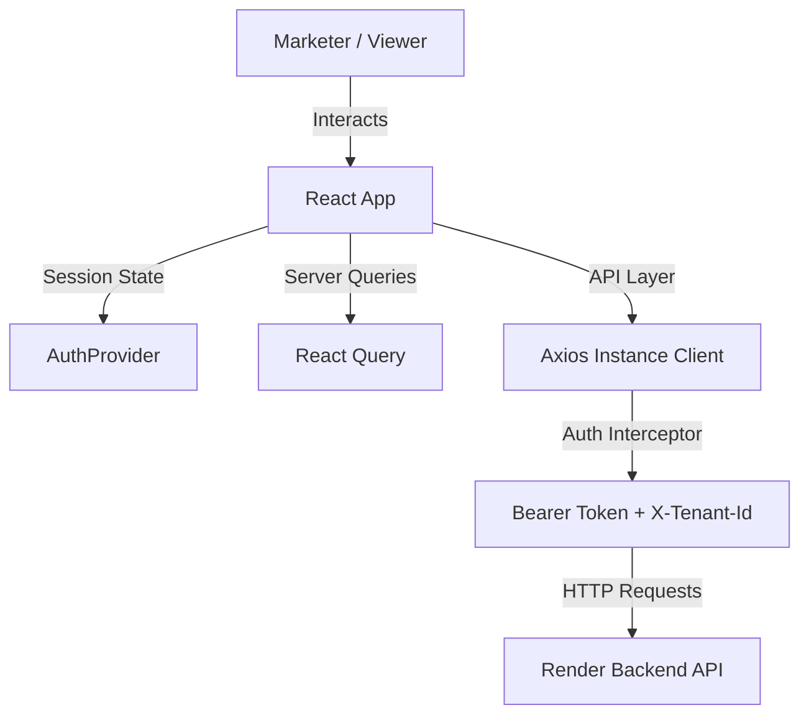

# 📱 StyleHub Xeno CRM — Frontend Web Application

The frontend of **StyleHub Xeno CRM** is a state-of-the-art Single Page Application (SPA) designed to wow users. It provides an intuitive, AI-driven interface where marketers can manage campaign strategies, check customer intelligence, analyze performance charts, and converse directly with a conversational retail agent.

---

## 🏗️ Architecture & Core Decisions



### Key Technical Decisions:
1. **React 19 & TypeScript**: Chosen for rendering performance, clean component architecture, and compile-time type safety.
2. **TailwindCSS v4**: Used to build a responsive, radial-themed premium user interface, incorporating harmonized dark modes, radial gradients, and modern typography.
3. **Axios Client Interceptors**: Restores authentication headers (`Authorization: Bearer <token>`) and multi-tenant scoping (`x-tenant-id`) dynamically on every request.
4. **React Router DOM**: Provides secure client-side routing, locking down dashboard access under a custom `<ProtectedRoute>` guard.
5. **Vite Bundler**: Empowers fast developer reload cycles and generates highly optimized, split production bundles.

---

## 📂 File Structure Hierarchy

The frontend is structured into modular components, api interfaces, custom hooks, and pages:

```
deploy-ready/frontend/
├── public/                     # Static assets (favicons, SVG assets)
├── src/
│   ├── main.tsx                # Entry point mounting App component
│   ├── App.tsx                 # Root application wrapper with Providers
│   ├── index.css               # Global CSS, Tailwind v4 imports, and visual theme tokens
│   ├── api/                    # HTTP clients
│   │   ├── auth.ts             # Auth endpoint queries (login, getTenants, profile)
│   │   └── client.ts           # Shared Axios instance with request/response interceptors
│   ├── assets/                 # Embedded graphic files
│   ├── hooks/                  # Custom React Hooks
│   │   ├── useAgent.ts         # Handlers for chat messaging and streaming
│   │   └── useAuth.tsx         # Auth session hook (session recovery & self-healing logins)
│   ├── lib/                    # Helper libraries
│   │   ├── agent.ts            # Local system prompts, tools lists, and llm dispatchers
│   │   └── tools.ts            # Client-side agent tool executors mapping function calls to API routes
│   ├── components/             # Reusable UI widgets
│   │   ├── ContextPanel.tsx    # Live KPIs, campaign status cards, and activity feeds
│   │   ├── PresenterMode.tsx   # Interactive slideshow (Japjot Singh presenter styling)
│   │   └── ToolStepCard.tsx    # Visual agent tool progress cards (Zap, Users, Megaphone icons)
│   └── pages/                  # Top-level screen components
│       ├── LoginPage.tsx       # Auth portal featuring auto-tenant self-healing checks
│       └── AgentPage.tsx       # Core dashboard containing live Chat & Presentation split views
├── package.json                # Fronted script manager and module list
├── tsconfig.json               # TypeScript workspace configuration
└── vercel.json                 # Vercel proxy configuration routing /api/v1 requests
```

---

## 🚀 Key Feature Functionality

### 1. Unified Presenter Dashboard (Japjot Singh)
* Contains a dedicated split view:
  * **Interactive Slideshow**: Left side features a custom slide panel tracking customer statistics (e.g. 29 dormant customers segment), product mockups, and strategy roadmaps. Fully styled with premium light-radial gradients for high-contrast presentation impact.
  * **AI Conversational Panel**: Right side displays a live chat interface to guide campaigns.
* Hardcoded presenter branding removes generic links, placing credit directly with **Japjot Singh**.

### 2. Autonomous Marketing Chat Agent
* The agent reads the user's plain-English marketing strategy goal and guides them step-by-step:
  * **Goal Analysis**: Classifies and suggests target segments.
  * **Channel Recommendation**: Displays an interactive channel comparison card (Email, WhatsApp, SMS, Push) with open rates and reasoning.
  * **Content Personalization**: Generates character-constrained templates containing parameters like `{{firstName}}`.
  * **Draft & Launch**: Deploys the campaign with a single click after double-confirmation.

### 3. Dynamic Sidebar Context Panel
* Syncs with the backend dynamically to fetch overall metrics (LTV, conversion rate, total customers).
* Lists active/draft campaigns, listing metrics (Sent / Delivered / Opened / Clicked) directly.
* Real-time activity logs show background system events as they occur.

---

## 🛠️ Deployment Instructions (Vercel)

### 1. Proxy Setup (`vercel.json`)
Make sure your backend API proxy targets your live Render backend URL:
```json
{
  "rewrites": [
    {
      "source": "/api/v1/:path*",
      "destination": "https://your-backend-app.onrender.com/api/v1/:path*"
    },
    {
      "source": "/((?!api/v1/).*)",
      "destination": "/index.html"
    }
  ]
}
```

### 2. Vercel Static Hosting Import
1. Create a new project on **Vercel.com**.
2. Connect your Git Repository.
3. Import the `deploy-ready/frontend` directory.
4. Set **Build Command** to `npm run build` and **Output Directory** to `dist`.
5. Deploy! Add the deployed URL to your backend's `CORS_ORIGINS` environment variables list.
